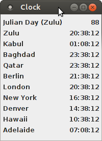

*DateClock*
===========

Summary
-------

Julian day and configurable Java multi-timezone clock application and/or
applet

Overview
--------

DateClock accepts a configuration file for timezones and a corresponding
logical name and displays the Julian day and the current time in GMT/Zulu,
plus the specified timezones.

